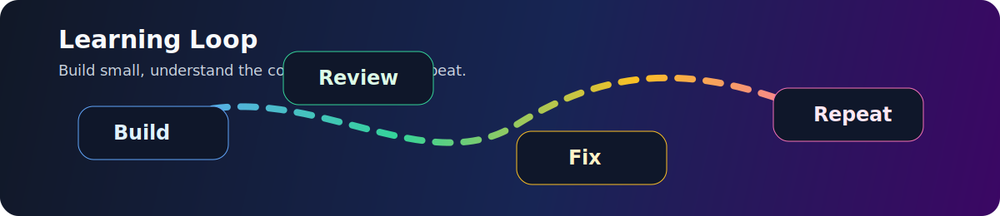

## About

Saya masih di tahap awal sebagai developer. Fokus utama saya sekarang adalah Python dan Java, sambil membangun dasar pemrograman yang kuat lewat project kecil.

## Roadmap

| Sekarang | Berikutnya |
| --- | --- |
| Python basics | File handling |
| Java OOP basics | Project berbasis class |
| Git dasar | Commit yang rapi |
| Latihan logika | Problem solving rutin |

## Starter Projects

| Project | Fokus |
| --- | --- |
| Calculator | Input, output, kondisi |
| Terminal notes app | Function dan file handling |
| Simple data manager | List dan CRUD dasar |
| Python exercises | Logika dan problem solving |
| Java class project | Class, object, method |

## Note

Visual di profil ini pakai file lokal dari repo, bukan badge atau statistik pihak ketiga.
